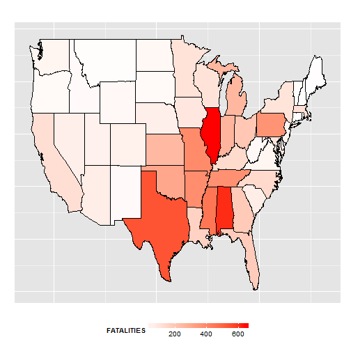

# Severe weather events on population health and economics.

## Synopsis

## Data Processing

The data is read and we use the str() to take a peek at the data:


```r
data<-read.csv("repdata-data-StormData.csv.bz2")
str(data)
```

```
## 'data.frame':	902297 obs. of  37 variables:
##  $ STATE__   : num  1 1 1 1 1 1 1 1 1 1 ...
##  $ BGN_DATE  : Factor w/ 16335 levels "1/1/1966 0:00:00",..: 6523 6523 4242 11116 2224 2224 2260 383 3980 3980 ...
##  $ BGN_TIME  : Factor w/ 3608 levels "00:00:00 AM",..: 272 287 2705 1683 2584 3186 242 1683 3186 3186 ...
##  $ TIME_ZONE : Factor w/ 22 levels "ADT","AKS","AST",..: 7 7 7 7 7 7 7 7 7 7 ...
##  $ COUNTY    : num  97 3 57 89 43 77 9 123 125 57 ...
##  $ COUNTYNAME: Factor w/ 29601 levels "","5NM E OF MACKINAC BRIDGE TO PRESQUE ISLE LT MI",..: 13513 1873 4598 10592 4372 10094 1973 23873 24418 4598 ...
##  $ STATE     : Factor w/ 72 levels "AK","AL","AM",..: 2 2 2 2 2 2 2 2 2 2 ...
##  $ EVTYPE    : Factor w/ 985 levels "   HIGH SURF ADVISORY",..: 834 834 834 834 834 834 834 834 834 834 ...
##  $ BGN_RANGE : num  0 0 0 0 0 0 0 0 0 0 ...
##  $ BGN_AZI   : Factor w/ 35 levels "","  N"," NW",..: 1 1 1 1 1 1 1 1 1 1 ...
##  $ BGN_LOCATI: Factor w/ 54429 levels "","- 1 N Albion",..: 1 1 1 1 1 1 1 1 1 1 ...
##  $ END_DATE  : Factor w/ 6663 levels "","1/1/1993 0:00:00",..: 1 1 1 1 1 1 1 1 1 1 ...
##  $ END_TIME  : Factor w/ 3647 levels ""," 0900CST",..: 1 1 1 1 1 1 1 1 1 1 ...
##  $ COUNTY_END: num  0 0 0 0 0 0 0 0 0 0 ...
##  $ COUNTYENDN: logi  NA NA NA NA NA NA ...
##  $ END_RANGE : num  0 0 0 0 0 0 0 0 0 0 ...
##  $ END_AZI   : Factor w/ 24 levels "","E","ENE","ESE",..: 1 1 1 1 1 1 1 1 1 1 ...
##  $ END_LOCATI: Factor w/ 34506 levels "","- .5 NNW",..: 1 1 1 1 1 1 1 1 1 1 ...
##  $ LENGTH    : num  14 2 0.1 0 0 1.5 1.5 0 3.3 2.3 ...
##  $ WIDTH     : num  100 150 123 100 150 177 33 33 100 100 ...
##  $ F         : int  3 2 2 2 2 2 2 1 3 3 ...
##  $ MAG       : num  0 0 0 0 0 0 0 0 0 0 ...
##  $ FATALITIES: num  0 0 0 0 0 0 0 0 1 0 ...
##  $ INJURIES  : num  15 0 2 2 2 6 1 0 14 0 ...
##  $ PROPDMG   : num  25 2.5 25 2.5 2.5 2.5 2.5 2.5 25 25 ...
##  $ PROPDMGEXP: Factor w/ 19 levels "","-","?","+",..: 17 17 17 17 17 17 17 17 17 17 ...
##  $ CROPDMG   : num  0 0 0 0 0 0 0 0 0 0 ...
##  $ CROPDMGEXP: Factor w/ 9 levels "","?","0","2",..: 1 1 1 1 1 1 1 1 1 1 ...
##  $ WFO       : Factor w/ 542 levels ""," CI","$AC",..: 1 1 1 1 1 1 1 1 1 1 ...
##  $ STATEOFFIC: Factor w/ 250 levels "","ALABAMA, Central",..: 1 1 1 1 1 1 1 1 1 1 ...
##  $ ZONENAMES : Factor w/ 25112 levels "","                                                                                                                               "| __truncated__,..: 1 1 1 1 1 1 1 1 1 1 ...
##  $ LATITUDE  : num  3040 3042 3340 3458 3412 ...
##  $ LONGITUDE : num  8812 8755 8742 8626 8642 ...
##  $ LATITUDE_E: num  3051 0 0 0 0 ...
##  $ LONGITUDE_: num  8806 0 0 0 0 ...
##  $ REMARKS   : Factor w/ 436781 levels "","-2 at Deer Park\n",..: 1 1 1 1 1 1 1 1 1 1 ...
##  $ REFNUM    : num  1 2 3 4 5 6 7 8 9 10 ...
```

We start off by converting the BGN_DATE column data to date-type. We also discard the time data in this column:


```r
data$BGN_DATE<-as.Date(as.character(data$BGN_DATE), "%m/%d/%Y")
```

And check that the converstion is OK:

```r
str(data$BGN_DATE)
```

```
##  Date[1:902297], format: "1950-04-18" "1950-04-18" "1951-02-20" "1951-06-08" ...
```

## Analysis

### Fatalities and Injuries. Summary statistics for the United States.
We take a look at what timeframe we are investigating. 

The first date is

```r
min(data$BGN_DATE)
```

```
## [1] "1950-01-03"
```

while the last date in the dataset is 

```r
max(data$BGN_DATE)
```

```
## [1] "2011-11-30"
```

We want to find out what are the most harmful weather effects to the population in the United States over the whole timeframe in question. To this end, we will look at fatalities and injuries. We will investigate these seperatly. We order the dataset based on the fatalities and injuries.


```r
library(plyr)
fatalities<-count(data, vars = "EVTYPE", wt_var = "FATALITIES")
fatalities<-fatalities[order(-fatalities$freq),]

injuries<-count(data, vars = "EVTYPE", wt_var = "INJURIES")
injuries<-injuries[order(-injuries$freq),]
```

And then reduce the data to the top 10 causes:

```r
fatalities<-fatalities[1:10,]
fatalities
```

```
##             EVTYPE freq
## 834        TORNADO 5633
## 130 EXCESSIVE HEAT 1903
## 153    FLASH FLOOD  978
## 275           HEAT  937
## 464      LIGHTNING  816
## 856      TSTM WIND  504
## 170          FLOOD  470
## 585    RIP CURRENT  368
## 359      HIGH WIND  248
## 19       AVALANCHE  224
```

```r
injuries<-injuries[1:10,]
injuries
```

```
##                EVTYPE  freq
## 834           TORNADO 91346
## 856         TSTM WIND  6957
## 170             FLOOD  6789
## 130    EXCESSIVE HEAT  6525
## 464         LIGHTNING  5230
## 275              HEAT  2100
## 427         ICE STORM  1975
## 153       FLASH FLOOD  1777
## 760 THUNDERSTORM WIND  1488
## 244              HAIL  1361
```


From the two tables, we see that in the time period from 1950-01-03 to 2011-11-30, Tornados are the most harmful weather events to public health.

### Fatalities and Injuries. State-by-state analysis.

We would like to analyze the fatalities and injuries caused by weather in each state.


```r
fatalities_by_state_tmp<-data[order(data$STATE, -data$FATALITIES),]
injuries_by_state_tmp<-data[order(data$STATE, -data$INJURIES),]
```

We trim the data to just the STATE, EVTYPE and FATALITIES or INJURIES variables.


```r
fatalities_by_state<-fatalities_by_state_tmp[,c("STATE", "EVTYPE", "FATALITIES")]
injuries_by_state<-injuries_by_state_tmp[,c("STATE", "EVTYPE", "INJURIES")]
```

Then sum the datasets by state:


```r
fatalities_by_state_s<-ddply(fatalities_by_state, .(STATE, EVTYPE), 
                             summarize, FATALITIES=sum(FATALITIES))

total_fatalities_per_state<-ddply(fatalities_by_state, .(STATE), 
                             summarize, FATALITIES=sum(FATALITIES))

injuries_by_state_s<-ddply(injuries_by_state, .(STATE, EVTYPE), 
                             summarize, INJURIES=sum(INJURIES))

total_injuries_per_state<-ddply(injuries_by_state, .(STATE), 
                             summarize, INJURIES=sum(INJURIES))
```

And sort by decsending number of fatalities/injuries per state:


```r
fatalities_by_state_r<-arrange(fatalities_by_state_s, 
                               fatalities_by_state_s$STATE,
                               -fatalities_by_state_s$FATALITIES)
injuries_by_state_r<-arrange(injuries_by_state_s, 
                               injuries_by_state_s$STATE,
                               -injuries_by_state_s$INJURIES)
```

We then reduce the data to the top fatalities/injury causes in each state:


```r
top_fatalities_per_state<-ddply(fatalities_by_state_r, .(STATE), 
                                function(x)x[1,])
top_injuries_per_state<-ddply(injuries_by_state_r, .(STATE), 
                              function(x)x[1,])
```

**Top causes of Fatalities per State:**

```r
top_fatalities_per_state
```

```
##    STATE                   EVTYPE FATALITIES
## 1     AK                AVALANCHE         33
## 2     AL                  TORNADO        617
## 3     AM MARINE THUNDERSTORM WIND          6
## 4     AN         MARINE TSTM WIND          6
## 5     AR                  TORNADO        379
## 6     AS                  TSUNAMI         32
## 7     AZ              FLASH FLOOD         62
## 8     CA           EXCESSIVE HEAT        110
## 9     CO                AVALANCHE         48
## 10    CT                HIGH WIND          6
## 11    DC           EXCESSIVE HEAT         20
## 12    DE           EXCESSIVE HEAT          7
## 13    FL              RIP CURRENT        172
## 14    GA                  TORNADO        180
## 15    GM MARINE THUNDERSTORM WIND          1
## 16    GU              RIP CURRENT         20
## 17    HI                HIGH SURF         21
## 18    IA                  TORNADO         81
## 19    ID                AVALANCHE         16
## 20    IL                     HEAT        653
## 21    IN                  TORNADO        252
## 22    KS                  TORNADO        236
## 23    KY                  TORNADO        125
## 24    LA                  TORNADO        153
## 25    LC              MARINE HAIL          0
## 26    LE              MARINE HAIL          0
## 27    LH              MARINE HAIL          0
## 28    LM       MARINE STRONG WIND          2
## 29    LO              MARINE HAIL          0
## 30    LS       MARINE STRONG WIND          1
## 31    MA                  TORNADO        108
## 32    MD           EXCESSIVE HEAT         88
## 33    ME                LIGHTNING          6
## 34    MH                HIGH SURF          0
## 35    MI                  TORNADO        243
## 36    MN                  TORNADO         99
## 37    MO                  TORNADO        388
## 38    MS                  TORNADO        450
## 39    MT                LIGHTNING          9
## 40    NC                  TORNADO        126
## 41    ND                  TORNADO         25
## 42    NE                  TORNADO         54
## 43    NH                TSTM WIND          6
## 44    NJ           EXCESSIVE HEAT         39
## 45    NM              FLASH FLOOD         16
## 46    NV                     HEAT         54
## 47    NY           EXCESSIVE HEAT         93
## 48    OH                  TORNADO        191
## 49    OK                  TORNADO        296
## 50    OR                HIGH WIND         19
## 51    PA           EXCESSIVE HEAT        359
## 52    PH       MARINE STRONG WIND          1
## 53    PK         MARINE HIGH WIND          0
## 54    PM               WATERSPOUT          0
## 55    PR              FLASH FLOOD         34
## 56    PZ       MARINE STRONG WIND          5
## 57    RI                     HEAT          2
## 58    SC                  TORNADO         59
## 59    SD                  TORNADO         18
## 60    SL              MARINE HAIL          0
## 61    ST             STRONG WINDS          0
## 62    TN                  TORNADO        368
## 63    TX                  TORNADO        538
## 64    UT                AVALANCHE         44
## 65    VA                  TORNADO         36
## 66    VI                HIGH SURF          3
## 67    VT                    FLOOD          4
## 68    WA                AVALANCHE         35
## 69    WI                  TORNADO         96
## 70    WV              FLASH FLOOD         24
## 71    WY                AVALANCHE         23
## 72    XX MARINE THUNDERSTORM WIND          0
```

**Top causes of Injuries per State:**

```r
top_injuries_per_state
```

```
##    STATE                   EVTYPE INJURIES
## 1     AK                ICE STORM       34
## 2     AL                  TORNADO     7929
## 3     AM MARINE THUNDERSTORM WIND       22
## 4     AN       MARINE STRONG WIND       18
## 5     AR                  TORNADO     5116
## 6     AS                  TSUNAMI      129
## 7     AZ               DUST STORM      179
## 8     CA                 WILDFIRE      623
## 9     CO                  TORNADO      261
## 10    CT                  TORNADO      703
## 11    DC           EXCESSIVE HEAT      316
## 12    DE                  TORNADO       73
## 13    FL                  TORNADO     3340
## 14    GA                  TORNADO     3926
## 15    GM              MARINE HAIL        0
## 16    GU        HURRICANE/TYPHOON      333
## 17    HI              STRONG WIND       20
## 18    IA                  TORNADO     2208
## 19    ID        THUNDERSTORM WIND       74
## 20    IL                  TORNADO     4145
## 21    IN                  TORNADO     4224
## 22    KS                  TORNADO     2721
## 23    KY                  TORNADO     2806
## 24    LA                  TORNADO     2637
## 25    LC              MARINE HAIL        0
## 26    LE              MARINE HAIL        0
## 27    LH              MARINE HAIL        0
## 28    LM       MARINE STRONG WIND        1
## 29    LO              MARINE HAIL        0
## 30    LS              MARINE HAIL        0
## 31    MA                  TORNADO     1758
## 32    MD           EXCESSIVE HEAT      461
## 33    ME                LIGHTNING       70
## 34    MH                HIGH SURF        1
## 35    MI                  TORNADO     3362
## 36    MN                  TORNADO     1976
## 37    MO                  TORNADO     4330
## 38    MS                  TORNADO     6244
## 39    MT         WILD/FOREST FIRE       33
## 40    NC                  TORNADO     2536
## 41    ND                  TORNADO      326
## 42    NE                  TORNADO     1158
## 43    NH                LIGHTNING       85
## 44    NJ           EXCESSIVE HEAT      300
## 45    NM                  TORNADO      155
## 46    NV                    FLOOD       50
## 47    NY                  TORNADO      315
## 48    OH                  TORNADO     4438
## 49    OK                  TORNADO     4829
## 50    OR                HIGH WIND       50
## 51    PA                  TORNADO     1241
## 52    PH       MARINE STRONG WIND        0
## 53    PK         MARINE HIGH WIND        0
## 54    PM               WATERSPOUT        0
## 55    PR               HEAVY RAIN       10
## 56    PZ       MARINE STRONG WIND        3
## 57    RI                  TORNADO       23
## 58    SC                  TORNADO     1314
## 59    SD                  TORNADO      452
## 60    SL              MARINE HAIL        0
## 61    ST             STRONG WINDS        0
## 62    TN                  TORNADO     4748
## 63    TX                  TORNADO     8207
## 64    UT             WINTER STORM      415
## 65    VA                  TORNADO      914
## 66    VI                LIGHTNING        1
## 67    VT                TSTM WIND       24
## 68    WA                  TORNADO      303
## 69    WI                  TORNADO     1601
## 70    WV                TSTM WIND      142
## 71    WY             WINTER STORM      119
## 72    XX MARINE THUNDERSTORM WIND        0
```


Let's make preperations for displaying the data :

```r
library(ggplot2)
library(maps)
library(datasets)
all_states<-map_data("state")
state_names<-data.frame(STATE=state.abb, region=tolower(state.name))
tmp<-merge(top_fatalities_per_state, state_names)
map_data<-merge(tmp, all_states, by='region')
ggplot(map_data, aes(map_id = region)) +
  geom_map(aes(fill = FATALITIES), map = all_states, color ="black") +
  expand_limits(x = all_states$long, y = all_states$lat) +
  theme(legend.position = "bottom",
        axis.ticks = element_blank(), 
        axis.title = element_blank(), 
        axis.text =  element_blank()) +
  scale_fill_gradient(low="white", high="red") +
  guides(fill = guide_colorbar(barwidth = 10, barheight = .5)) + 
  ggtitle("")
```

 


### Economic Consequences. Summary statistics for the United States.


## Results


